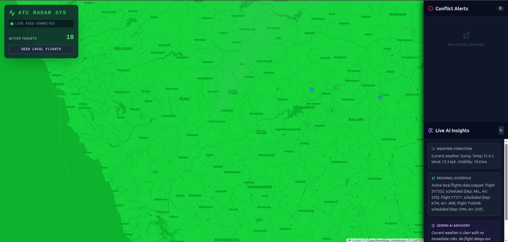

# Air Traffic Control Simulation System ✈️🗼

A comprehensive, full-stack, real-time Air Traffic Control (ATC) simulation dashboard. This project demonstrates backend engineering, real-time systems, system design, and modern frontend development.



## ✨ Features

- **Real-Time Aircraft Simulation**: A Spring Boot backend simulates aircraft movement using scheduled tasks, updating latitudes and longitudes periodically based on real-world kinematics.
- **WebSocket Broadcasts**: Live telemetry and conflict data are streamed to the frontend via STOMP over WebSockets.
- **Conflict Detection Engine**: Detects when two aircraft violate the safety threshold (horizontal distance < 5km and altitude difference < 1000ft) using the Haversine formula.
- **Radar Dashboard**: A React + React-Leaflet frontend displaying active targets with custom dynamic markers, popups, and a synchronized radar-sweep animation.
- **Conflict Alerts Sidebar**: A live dashboard that dynamically alerts users when collision warnings occur in real time.
- **Flight Database**: Stores and serves flight entities and tracking telemetry using MongoDB.

## 🛠️ Tech Stack

**Backend:** Java 21, Spring Boot, Spring Web, Spring Data MongoDB, Spring WebSockets, Spring Scheduling
**Frontend:** React (Vite), React-Leaflet, Tailwind CSS, Lucide React, SockJS, STOMPjs
**Database:** MongoDB

## 📂 Project Structure

```
├── backend/
│   ├── src/main/java/com/atc/simulator/
│   │   ├── controller/          # REST API Controllers
│   │   ├── model/               # MongoDB Document Models
│   │   ├── repository/          # MongoDB Repositories
│   │   ├── service/             # CRUD, Simulation, and Conflict Detection Services
│   │   └── websocket/           # STOMP/SockJS Configuration
│   └── pom.xml                  # Maven Dependencies
├── frontend/
│   ├── src/
│   │   ├── components/          # RadarMap and ConflictAlerts UI components
│   │   ├── services/            # WebSocket connection service
│   │   ├── App.jsx              # Main Dashboard Layout
│   │   └── index.css            # Tailwind & Radar Animations
│   ├── package.json             # NPM Dependencies
│   └── tailwind.config.js       # Tailwind Styling Configuration
└── README.md
```

## 🚀 Getting Started (Local Development)

### 1. Prerequisites
- Java 21
- Node.js (v18+)
- Maven
- MongoDB (Running locally on default port 27017)

### 2. Start the Database
Ensure MongoDB is running on your system.
```bash
sudo systemctl start mongod
```

### 3. Start the Backend
Navigate to the `backend` directory, install dependencies, and run the Spring Boot application.
```bash
cd backend
./mvnw clean package -DskipTests
./mvnw spring-boot:run
```
*The backend will start on http://localhost:8080*

### 4. Start the Frontend
Navigate to the `frontend` directory, install dependencies, and run the Vite development server.
```bash
cd frontend
npm install
npm run dev
```
*The frontend will start on http://localhost:5173*

## 🔌 API Endpoints
- `POST /api/flights` - Create a flight
- `GET /api/flights` - Get all flights
- `GET /api/flights/{flightNumber}` - Get flight by number
- `PUT /api/flights/{flightNumber}` - Update flight
- `DELETE /api/flights/{flightNumber}` - Terminate a flight

To seed initial data, quickly `POST` a few json payloads to `/api/flights`:
```json
{
  "flightNumber": "AA123",
  "latitude": 40.6413,
  "longitude": -73.7781,
  "altitude": 32000,
  "speed": 500,
  "heading": 45
}
```

## 🎥 Simulated View
Once started, the backend automatically periodically simulates the heading and position changes of the flights and emits events. WebSockets handle pushing this instantly to the React frontend UI, and detecting any proximities.
